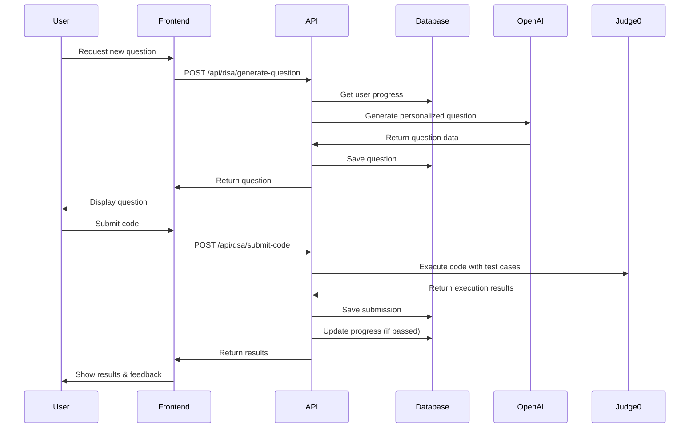

# DSA Question Generation & Code Compilation System

## Overview

This system provides **personalized** Data Structures and Algorithms (DSA) questions for each user, utilizing OpenAI API for question generation and Judge0 API for code compilation and execution.

## Key Features

### 🎯 Personalization

- **User-Specific Questions**: Each question is generated and stored per user
- **Skill-Based Difficulty**: Questions adapt to user's skill level (beginner → intermediate → advanced → expert)
- **Weakness Focus**: 70% of questions target user's weak areas
- **Progress Tracking**: Comprehensive tracking of solved questions by difficulty

### 🤖 AI-Powered Generation

- Uses OpenAI GPT-4 to generate unique, original DSA questions
- Questions are NOT copied from LeetCode or other platforms
- Includes examples, test cases, hints, and complexity analysis
- Provides starter code templates for multiple languages

### 💻 Code Execution

- Real-time code compilation and execution using Judge0
- Supports multiple languages: Python, JavaScript, Java, C++, TypeScript, Go, Rust
- Runs against hidden test cases
- Provides detailed execution feedback (time, memory, errors)

## Database Schema

### Tables Created

#### 1. `dsa_questions`

Stores user-specific generated DSA questions

- `userId` - Links question to specific user
- `title`, `description`, `difficulty`, `category`
- `testCases` - Hidden test cases (JSON)
- `starterCode` - Code templates for multiple languages (JSON)
- `hints` - Progressive hints (JSON array)
- `timeComplexity`, `spaceComplexity` - Expected complexities

#### 2. `dsa_submissions`

Tracks all code submissions

- `userId`, `questionId` - User and question references
- `code`, `language` - Submitted code and language
- `status` - accepted, wrong_answer, runtime_error, etc.
- `executionTime`, `memory` - Performance metrics
- `testCasesPassed`, `totalTestCases` - Success rate

#### 3. `user_dsa_progress`

Maintains user progress and personalization data

- `totalQuestionsSolved` - Overall count
- `easyQuestionsSolved`, `mediumQuestionsSolved`, `hardQuestionsSolved` - By difficulty
- `skillLevel` - Current skill level (auto-updated)
- `weakCategories` - Categories needing improvement (JSON)
- `preferredCategories` - Strong categories (JSON)

## API Endpoints

### 1. Generate Personalized Question

**POST** `/api/dsa/generate-question`

```json
{
  "userId": "user_123"
}
```

**Response:**

```json
{
  "success": true,
  "question": {
    "id": 1,
    "userId": "user_123",
    "title": "Find Missing Number in Array",
    "description": "...",
    "difficulty": "easy",
    "category": "arrays"
    // ... other fields
  }
}
```

### 2. Submit Code for Execution

**POST** `/api/dsa/submit-code`

```json
{
  "userId": "user_123",
  "questionId": 1,
  "code": "def solution(arr):\n    return sum(range(len(arr)+1)) - sum(arr)",
  "language": "python"
}
```

**Response:**

```json
{
  "success": true,
  "submission": {
    "id": 1,
    "status": "accepted",
    "executionTime": "0.023",
    "memory": "2048",
    "testCasesPassed": 5,
    "totalTestCases": 5
  },
  "results": [
    {
      "input": "[1,2,4,5]",
      "expectedOutput": "3",
      "actualOutput": "3",
      "passed": true,
      "status": "accepted",
      "executionTime": "0.023",
      "memory": "2048"
    }
  ],
  "summary": {
    "totalTestCases": 5,
    "passedTestCases": 5,
    "status": "accepted",
    "allPassed": true
  }
}
```

### 3. Get User Questions

**GET** `/api/dsa/questions?userId=user_123`

Returns all questions generated for the user.

### 4. Get Specific Question

**GET** `/api/dsa/questions/[questionId]?userId=user_123`

Returns detailed question with parsed JSON fields.

### 5. Get User Progress

**GET** `/api/dsa/progress?userId=user_123`

```json
{
  "success": true,
  "progress": {
    "userId": "user_123",
    "totalQuestionsSolved": 15,
    "easyQuestionsSolved": 8,
    "mediumQuestionsSolved": 5,
    "hardQuestionsSolved": 2,
    "skillLevel": "intermediate",
    "preferredCategories": ["arrays", "strings"],
    "weakCategories": ["graphs", "dynamic-programming"]
  }
}
```

### 6. Update User Progress

**PUT** `/api/dsa/progress`

```json
{
  "userId": "user_123",
  "weakCategories": ["graphs", "trees"],
  "preferredCategories": ["arrays", "strings"]
}
```

### 7. Get Submissions

**GET** `/api/dsa/submissions?userId=user_123&questionId=1`

Returns submission history with question details.

### 8. Delete Question

**DELETE** `/api/dsa/questions?questionId=1&userId=user_123`

## Setup Instructions

### 1. Install Dependencies

The project already has required dependencies. If needed:

```bash
npm install
```

### 2. Configure Environment Variables

Create a `.env.local` file in the root directory:

```env
# OpenAI API Key
OPENAI_API_KEY=sk-proj-xxxxxxxxxxxxx

# Judge0 API Key (from RapidAPI)
JUDGE0_API_KEY=your_rapidapi_key_here
JUDGE0_HOST=judge0-ce.p.rapidapi.com
```

**Getting API Keys:**

#### OpenAI API Key:

1. Go to https://platform.openai.com/api-keys
2. Create a new API key
3. Copy and paste into `.env.local`

#### Judge0 API Key:

1. Go to https://rapidapi.com/judge0-official/api/judge0-ce
2. Subscribe to a plan (free tier available)
3. Copy your RapidAPI key
4. Paste into `.env.local`

### 3. Run Database Migrations

```bash
# Generate migration
npx drizzle-kit generate

# Apply migration
npx drizzle-kit migrate
```

### 4. Run the Application

```bash
npm run dev
```

## How Personalization Works

### Question Generation Algorithm

1. **Fetch User Progress**: Get current skill level and question history
2. **Determine Difficulty**:
   - Beginner (0-10 solved): Easy questions
   - Intermediate (10-50 solved): 70% easy, 30% medium
   - Advanced (50-100 solved): 50% medium, 50% hard
   - Expert (100+ solved): 30% medium, 70% hard

3. **Select Category**:
   - 70% chance: Focus on weak categories
   - 30% chance: Random category for variety

4. **Generate with OpenAI**:
   - Uses high temperature (0.9) for unique questions
   - Instructs to create original problems
   - Includes educational hints and examples

5. **Save to Database**: Question is linked to specific user

### Progress Updates

When a user solves a question (all test cases pass):

- Increment difficulty-specific counter
- Update total questions solved
- Auto-upgrade skill level based on milestones
- Update last activity date

## Supported Languages

| Language   | Judge0 ID | File Extension |
| ---------- | --------- | -------------- |
| Python 3   | 71        | .py            |
| JavaScript | 63        | .js            |
| Java       | 62        | .java          |
| C++        | 54        | .cpp           |
| C          | 50        | .c             |
| TypeScript | 74        | .ts            |
| Go         | 60        | .go            |
| Rust       | 73        | .rs            |

## Example Usage Flow



## Testing the APIs

### 1. Generate a Question

```bash
curl -X POST http://localhost:3000/api/dsa/generate-question \
  -H "Content-Type: application/json" \
  -d '{"userId": "user_123"}'
```

### 2. Submit Code

```bash
curl -X POST http://localhost:3000/api/dsa/submit-code \
  -H "Content-Type: application/json" \
  -d '{
    "userId": "user_123",
    "questionId": 1,
    "code": "def solution(arr):\n    return sum(range(len(arr)+1)) - sum(arr)",
    "language": "python"
  }'
```

## Important Notes

### Security

- Questions are user-specific - users can only access their own questions
- API validates userId ownership before returning or executing questions
- Test cases include both visible examples and hidden cases

### Personalization Features

- Each user gets unique questions tailored to their level
- System learns from submission history
- Questions adapt as user progresses
- Focus on weak areas for targeted improvement

### Performance

- Uses GPT-4o-mini for cost-effective generation
- Judge0 provides fast code execution (< 1 second typically)
- Results include execution time and memory usage
- Database indexes on userId for fast queries

## Future Enhancements

- [ ] Add more DSA categories (bit manipulation, math, etc.)
- [ ] Implement difficulty progression based on success rate
- [ ] Add social features (share questions, leaderboards)
- [ ] Generate explanations for solutions
- [ ] Video/visual explanations for complex topics
- [ ] Code quality analysis and suggestions
- [ ] Time/space complexity validation
- [ ] Mock interview mode with timed challenges

## Troubleshooting

### OpenAI API Errors

- Check API key is valid and has credits
- Verify key has proper permissions
- Check rate limits (RPM/RPD)

### Judge0 API Errors

- Verify RapidAPI subscription is active
- Check daily request limits
- Ensure JUDGE0_HOST is correct

### Database Issues

- Run migrations: `npx drizzle-kit migrate`
- Check database connection in `app/config/db.tsx`
- Verify table creation in database

## API Rate Limits

### OpenAI

- Free tier: Limited requests
- Pay-as-you-go: Based on tokens used
- Recommended: Set up billing alerts

### Judge0 (RapidAPI)

- Free tier: 50 requests/day
- Basic plan: 100-500 requests/day
- Pro plans: Higher limits available

## Support

For issues or questions:

1. Check this documentation
2. Review API error messages
3. Check environment variable configuration
4. Verify API keys are active and have credits
